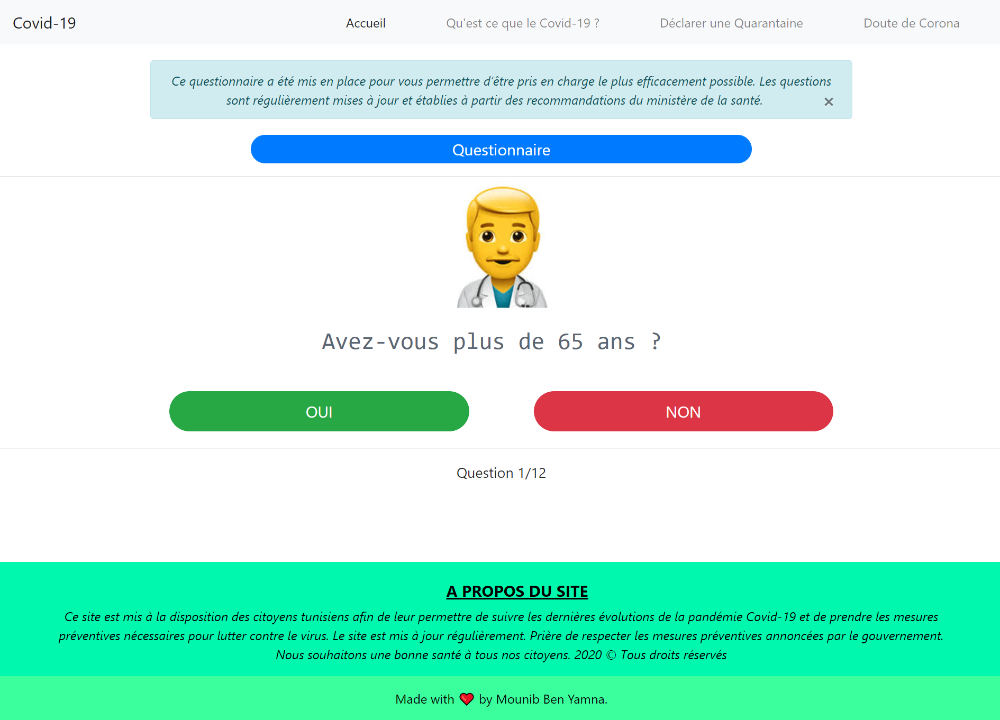
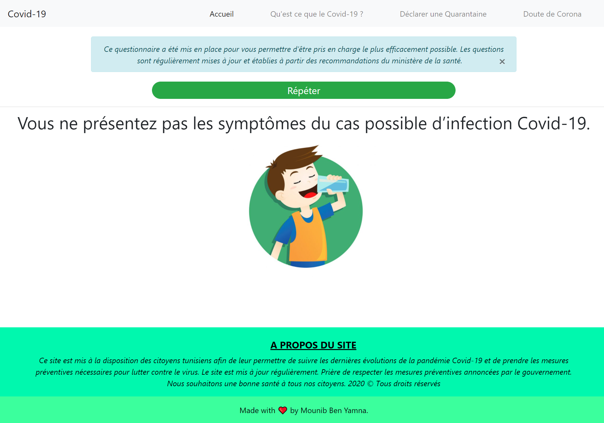
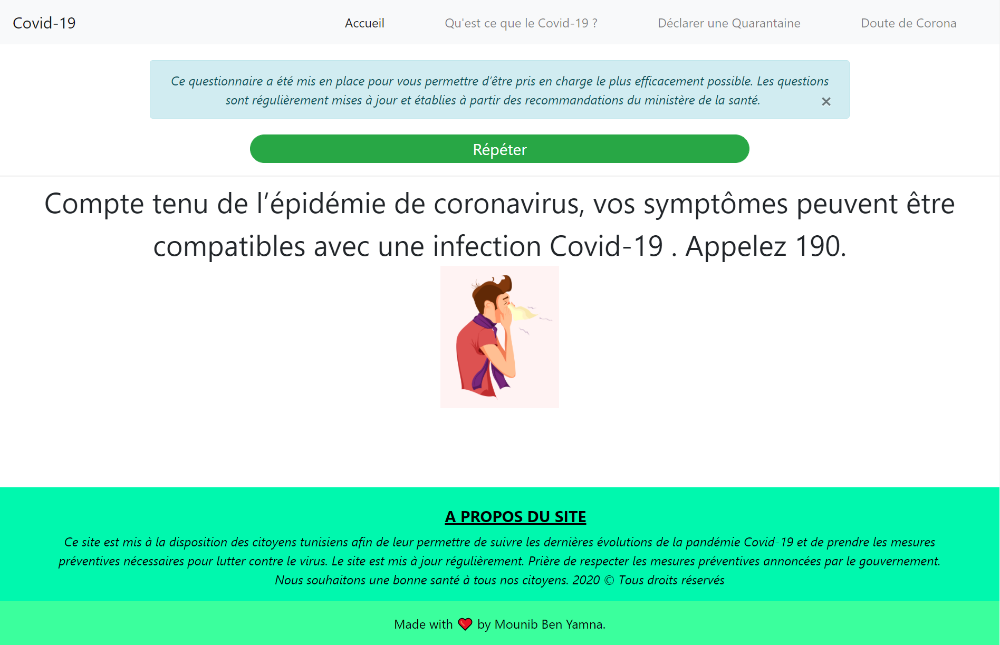

CoronaApp est une application web créé avec Angular 8 où vous pouvez savoir qu'est ce que le covid19 , déclarer une quarantaine et répondre a un questionnaire si vous doutez d'un cas de covid .

Pour savoir plus visiter https://bymounib.github.io/CovidApp/Home

## Voici quelques captures d'écran de la partie doute de CORONA:

